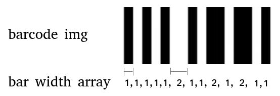

# Bar Width Array

This project produce the "Bar Width Array" of 1D barcode. It is useful for performance evaluation of barcode reader.

## Additional

This project is started as a custom offer on Fiverr. The order I placed is done by Yousra Mashkoor and Sidra Rehmani.
